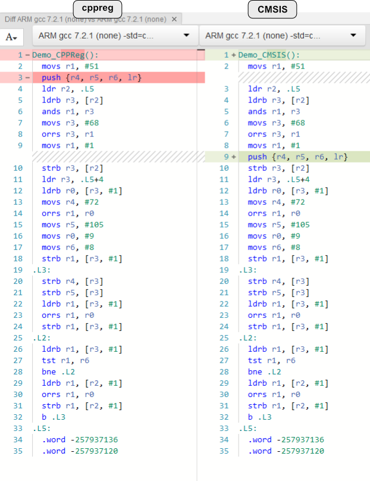

# Performance analysis
`cppreg` is heavily based on C++ templates and introduces various levels of abstractions compared to a traditional C CMSIS implementation. Because of C++'s *zero overhead* capabilities (see [this](https://www.youtube.com/watch?v=zBkNBP00wJE) for example) and when using at least some level of compiler otpimizations *all* the `cppreg` interface code is optimized away. Understandably most would question the validity of such a claim, so this document demonstrates a classic example showing that a register interface written with `cppreg` produced a compiled code identical to a CMSIS-based one.


## Test setup
For the test example, let's use an imaginary Cortex-M0 based micro-controller with the intention of having the UART send out a small string and then toggle two LEDs (PIN1 and PIN3) after every transmission. Why imaginary? Because a real implementation will be longer than most screens. The example is written in C using CMSIS style, and then in C++ using `cppreg`. We then compare the assembly outputs of both using GCC ARM with links to GodBolt so that the examples can be fiddled with.


### Example peripheral

```
# Imaginary super simple GPIO Peripheral
(GPIO_Base) GPIO Peripheral Base Address: 0xF0A03110
    # 8 bits wide (2 bit per pin)
    # 00 = Input, 01 = Output, 10 = Reserved, 11 = Reserved
    # Our LEDS are on PIN1 and PIN3
    GPIO Direction Register: GPIO_Base + 0x00

    # 8 bits wide (1 bit per pin)
    # 0 = Do not toggle, 1 = Toggle
    GPIO Toggle Register: GPIO_Base + 0x01

# Imaginary super simple UART peripheral
(UART_Base) UART Peripheral Base Address: 0xF0A03120
    # 8 bits wide, write bytes to here to insert into the TX FIFO
    UART TX FIFO Register: UART_Base + 0x00

    # 8 bits wide, Status Register
    # BIT 0 (Enable)  = Set to enable UART, Clear to disable.
    # BIT 1 .. 2      = Reserved0, read only
    # Bit 3 (Sending) = Set to send, stays set till TX FIFO empty.
    # BIT 4 .. 7      = Reserved1, read only
    UART Status Register: UART_Base + 0x01
```


## CMSIS Style
This snippet is based on a CMSIS style code, which makes heavy use of preprocessor macros (the `#define` directives) and directly maps structures onto the memory. Notice how we have to do all the binary arithmetic ourselves which is extremely error prone and tedious. Obviously the binary arithmetic could itself be simplified using macros or functions, but that will not provide more safety or clarity (let alone compile time detection of ill-formed statements and enforcement of access policies).

```c
#include <stdint.h>

// Structs for each peripheral.
#define __IO volatile
typedef struct {
    __IO uint8_t DIRECTION; // Base + 0x00
    __IO uint8_t TOGGLE;    // Base + 0x01
} GPIO_TypeDef;
typedef struct {
    __IO uint8_t TXFIFO;  // Base + 0x00
    __IO uint8_t STATUS;  // Base + 0x01
} UART_TypeDef;

// Memory addresses where peripherals are.
#define PERIPH_BASE ((uint32_t)0xF0A03110)
#define GPIOA_BASE (PERIPH_BASE + 0x0000)
#define GPIO ((GPIO_TypeDef *) GPIOA_BASE)
#define UART_Base (PERIPH_BASE + 0x0010)
#define UART ((UART_TypeDef *) UART_Base)

void Demo_CMSIS(){

    // Make only PIN1 and PIN3 to output with masking.
    const uint16_t DIRECTION_PIN_MASK = (0b11u << (1 * 2)) | (0b11u << (3 * 2));
    GPIO->DIRECTION = (GPIO->DIRECTION & ~DIRECTION_PIN_MASK) | (1u << (1 * 2)) | (1u << (3 * 2));

    // Enable the UART.
    const uint8_t UART_STATUS_ENABLE = 0x01u;
    UART->STATUS = UART->STATUS | UART_STATUS_ENABLE;

    // Loop over forever.
    while(true){
        // Put a string into the FIFO.
        UART->TXFIFO = 'H';
        UART->TXFIFO = 'i';

        // Start sending out TX FIFO contents.
        const uint8_t UART_STATUS_SENDING = 1u << 3;
        UART->STATUS = UART->STATUS | UART_STATUS_ENABLE | UART_STATUS_SENDING;

        // Wait till the UART is done.
        while ((UART->STATUS & UART_STATUS_SENDING) != 0u) {}

        // Toggle the GPIO.
        GPIO->TOGGLE = GPIO->TOGGLE | (1u << 0) | (1u << 3);
    };
    
};
```


## `cppreg` style
This is written to mimic the CMSIS example as close as possible. `cppreg` handles the binary arithmetic for us as well as enforcing access policies and detection of ill-formed statements at compile time. While the `cppreg` version is somewhat more verbose for defining the registers, it is much easier and clearer to work with at the calling site. As a side note, one of the long-term goal of this project is (at some point) to provide scripts for automatic generation based on SVD data.

```c++
#include "cppreg-all.h"

struct GPIO {

    struct GPIO_Cluster : cppreg::RegisterPack<0xF0A03110, 4u> {};

    struct Direction : cppreg::PackedRegister<GPIO_Cluster, cppreg::RegBitSize::b8, 0> {
        using PIN0   = cppreg::Field<Direction, 2u, 0u, cppreg::read_write>;
        using PIN1   = cppreg::Field<Direction, 2u, 2u, cppreg::read_write>;
        using PIN2   = cppreg::Field<Direction, 2u, 4u, cppreg::read_write>;
        using PIN3   = cppreg::Field<Direction, 2u, 6u, cppreg::read_write>;
    };

    struct Toggle : cppreg::PackedRegister<GPIO_Cluster, cppreg::RegBitSize::b8, 8> {
        using PIN0 = cppreg::Field<Toggle, 1u, 0u, cppreg::write_only>;
        using PIN1 = cppreg::Field<Toggle, 1u, 1u, cppreg::write_only>;
        using PIN2 = cppreg::Field<Toggle, 1u, 2u, cppreg::write_only>;
        using PIN3 = cppreg::Field<Toggle, 1u, 3u, cppreg::write_only>;
        using Reserved = cppreg::Field<Toggle, 3u, 4u, cppreg::read_only>;
    };
    
};

struct UART {

    struct UART_Cluster : cppreg::RegisterPack<0xF0A03120, 2u> {};

    struct TXFIFO : cppreg::PackedRegister<UART_Cluster, cppreg::RegBitSize::b8, 0> {
        using DATA = cppreg::Field<TXFIFO, 8u, 0, cppreg::write_only>;
    };

    struct STATUS : cppreg::PackedRegister<UART_Cluster, cppreg::RegBitSize::b8, 8> {
        using Enable = cppreg::Field<STATUS, 1u, 0, cppreg::read_write>;
        using Reserved0 = cppreg::Field<STATUS, 2u, 1, cppreg::read_only>;
        using Sending = cppreg::Field<STATUS, 1u, 3, cppreg::read_write>;
        using Reserved1 = cppreg::Field<STATUS, 4u, 4, cppreg::read_only>;
    };
    
};

void Demo_CPPReg(void){

    // Make the pins be an output.
    GPIO::Direction::merge_write<GPIO::Direction::PIN1>(1)
        .with<GPIO::Direction::PIN3>(1).done();

    // Enable the UART.
    UART::STATUS::Enable::set();

    // Loop over forever.
    while(true){
        // Put a string into the FIFO.
        UART::TXFIFO::DATA::write<'H'>();
        UART::TXFIFO::DATA::write<'i'>();

        // Start sending out TX FIFO contents.
        UART::STATUS::merge_write<UART::STATUS::Enable, 1>()
            .with<UART::STATUS::Sending, 1>().done();

        // Wait till the UART is done.
        while(UART::STATUS::Sending::is_set()) {}

        // Toggle the GPIO.
        GPIO::Toggle::merge_write<GPIO::Toggle::PIN0, 1>()
            .with<GPIO::Toggle::PIN3, 1>().done();
    };
    
};
```

## Assembly results and comparison

[This][godbolt] is how GodBolt compares the CMSIS and `cppreg` versions. Looking at the assembly, it's pretty much identical, with the only difference being when to save registers onto the stack (in this case having no performance penalty). For this example (as well as others which have been tested), there is *no* performance penalty in the `cppreg` implementation; here is a comparison of the assembly outputs (obtained with GCC ARM `-mthumb -Os`):




[godbolt]: https://godbolt.org/#z:OYLghAFBqd5TKALEBjA9gEwKYFFMCWALugE4A0BIEAViAIzkA2AhgHaioCkATAEK8%2B5AM7oArqVTYQAcgD0csGADUqAA5rS2YMqYEARqRakAngDouABgCCcgFR2r15XeUABAGYEm2ZX//qmtoAtCxMTGZITi7uLGJESGT%2BygByBBiswsoAwqxiAG7YemzKEGyoeYXFbsLYbJgmbNhmGAC2AJTRrm4YaiakBMBIRDnofQNDIzyW9JbB0/QAnMoAynUNTaOkambK1uHKE8NZWrWkhZgWNi5yTnc8AMwE5UxiOMpcD9mowkSEbERPrh7k8Xm9fJ9skQTGpsAB9IhGYjCIEg54VcEfL4eMTlIgEdBsMKomy8UEY96QvStZEk6xOBSqDRaYBwgAi2C8TWEkTRHnqnJyAAUhQAlXAAcTh2RF4qlbNwADEAJIpXArOEACRBOC5vhlYsl0tlRoVKrVGu1NiJrWwwjULCkTKCOi4AHYBDYxMJnjprJhMKcsp82cpfpgQCAxM8iGpEQjPp7rHUxK1VJksqLtHxiCsCAAvXwgMN/SPRgEADgRHw90X8%2Bgr5GSH2u9foADYm/46359A8eF2/D3lPp2wAWZt3N1sxNOb2%2B5SKghFTAAdQImASWND4bLMargIeSfnHEXy6YmAA8h4PLURiGSxGo/uE0enERsK01KwP1ioTC6hYW1lAAFTpX5SDEVARmhWE4VaFhhAAaxrJNkgwNhfmwAAPTQSxYfFUFUQlflA5R8jCMQIQeHdSxANhU2wAZUDhalaS%2BMCHlwSMEOwiBOjfUlp1nITQ27UlHnWAgPGSO4bEZECkSIHkogkp5%2BV1YVDSlEDRWsZUQMtHVOWefUTR0vSDKM60gLtB0nUCFlUPfT9vwI6jsizYAcyIPNC1WcDESgkYQIAxSWGRZzhME6wPy/H8PMCyDoNAsKlJRL4vJ8vzpBABsgWc1s/BPHRYOo2in3LIgDxE5wAhIj9cNIfDCOUOISBHYg4R9fyH13Z9KwTD0K3dGcYvQhqcLw34CPSNr4nQEcTA/bqC3Kx890GwEPX0Lqet8ORlBG6Kk1G2q4rc39ISS4LUthcL2M87NczWyN9A7Ar3TQ/wSuUMrtw2gaiA7V9vr8DCsKalq5vaxbdqIVbepowGqpqj0PpO4cIca6aiFmojYaWlb9oB/rUaGvh4cRg6jrOmK6aTC6Er/G6UtC%2B70shLKXsLN7%2B0%2B2siuUX7/r6uiqv7UGscmqGZtawmqZJsXKpfba%2BH5zGhexqbmrlmGFqJ%2BEleRsnVa%2BxW1uUQ7jrG07Ndi1zmeurinAg272ewB7lK557fNevLxwFsHhZ9U9RZN8WY3HKWtZl3H8fmjqLaRirNuqinA/tibMJx3W8flg39GWo3LeVtO0cpvbLethmp1tuvZLUqSZPE%2Bl5MO5UASYokmBUvkBRkg05ThVUQNwUUUmsAAZaz6UeXVTK04fR/HyeZ61JwbTsx1fEc7RCusLf7R35QY27sJg0Fh34vcv8yq30CmxA8jKOwJ/dAIGlD2BGw3ZS1AkDYFQEhOE6BCikA8EwdAAB3ZQxZ%2Bpn2AEYJgcJsbsEPNkfQ6B0BMCbBRV4iVkZsW/lFeuNgma30hP6QMdosgsADEGJs/V9rVjCIMNgtoASsxGAQYQcI2HACaJgYc8C6KIOQaghq6DIRYJwU2CA9CaHCGDDwdspQBEcLqCMYIyh6DtHaNuB8lgg611Eo3ek05zFkmblY9uygACyn4yDmFUnPdSA8l6mlwAANThPY3A9jLyigAJobzUgvTYQ8vG%2BP8YEkJYTD62WPg5Zk%2B8vouRvldL41CgwjkQvCRRjCUYxkliMeyICi7EzWtw5QXleEflIEKR0KF0mxxzjraGRFsZ7AYbQ5Q5S4T6HyQDIZtR%2BG9OUbVbOkN46tW6abAEpSwxrThM8QZxdgzIwGZUkuhZaqmOvpdDyOS%2Bm2laOMpRwgmF0RYSMM56yql7Jdr/IKKVHGtGcRyfI6QIRX2SL9M5zjuokCMMAda/VjBGBMJCfIODZo%2BGKVtJs9ydnU1RONfwesiKAtMMCsgLAwW8DUfBT8eLQXYCmf4ChWSnreR5r4Fk1NrlPluYbUBN47x0mSFi4iOdyJwvxAi%2B%2Btk7qe05l8Rl%2B0gSRjKkSw46ASUfNMPxA%2BzZMX53SPw5RTEiAQGHGqvwZ9SA92EJGXh/C9CCOwMIr49zCl9MEGy9AHLsBEHIPqg1nqvXNghZazRAJ2WQmFcBD2XsMrZA9d6qNUbJXVK4jKgC0qQD4KokmlNb9I2Th4Dwd5nzsDfKkJGeVhxsAAEcqKkTYOgEYGjrW8B4AJYOyQtBEAkCUOwEAtBGqCAjVAiEMHdNhT%2BbwFKhbRvHc2YNvhQ3iuyLGp53EQBlUcFxPVY6DVEsVWSglFKACslNi7stvK6rgu62T6MpUOYSQtqUeW5n7fy8636A1Zai51x7v7Dh5UO%2BFvgp2irDZCJ9SbZWqMONAxVziVWtLqmqrFWqzi6szckI1JqzV8NrTa7IdqJkqL4E6l1brkMTqjb69hnCEbOqDQBB%2BM6Irey%2BMRkj47gPxqXYmtj6a02v3deutV9bc2mC%2BT8otpBYFaHLXaEYVaa1%2BrrdmxtmaW1tpcGu2DXqu1d22C21B/aYUCpHX9GjIq6OPVY4u5dQI1PMc3fc34%2BLCX7rfYR0957FNCzOqJc6jtKHZNw21ZlkZWUZR/rFYzwFBMmGE1ISELAmFJpxSYbdhKwOReixSr4cWwxJq3fZ8lhihYds0w0ntunfjUdhA/NL%2Bafmxfi2xxLyXsArtwAoi9MVb133C74OpWFGnNJqb1hp1WC2/ODgC0lOBRsFfU8kEbtXMraHqUxJpwDIzbPyU2IbK3mlBZWWsnZIX9n21GlYyS9RpK2NsIdawqApDKKFDg9ILj%2B6aSiVKaw2RsjqhWEKS8U9lTZFCVaNxESzLaThJ977Kxfv/cB8DzeST7K71Sa6K%2BnWKuARDe/BCyEmxLhXNeD9yh32cuedYP%2BPC%2BGIgIN8sIcIxMiMBuI%2BnaCuFfFkbgpjzG/AQFxy0miD4yrwUQkhSEnFF3ps6HxnnXqiVyogKT11hjkYE4vETzlHpjHTgErgUh3nMkeX/SBHHov8fnivIRknhGmz/oAKp0l%2BuamndOmAzeSP%2B/qgF9A%2BFWR4SEzuBiu4Z9A8XyKzfW4/dxghTYHdsdlR1nzNLjem7x2eQnVulduqM5VkVcfQtO74TJhEQeCBhHd1S7rgNve%2B%2BkpCJQgfadl5QYzji4e09Z%2Bj1RWPIGOOMyT0bqv9j7HKkvLbqvJuyL8/Nxn4nnfyeU9qUtvrWZ6GqqpQPrrufgJ24BrCjcXL1UJ2floehEBunD9H3K1oNIFVTZ%2Bbx2b47zXF5d83sPyhp%2BR7vD3rirgHwMThBxikAGJVo4RSBxjr5qrKbGqdJlYYIS5QA34Ehwj35OjX6i4GLop65Z7ubqaebqYY5fD2577oAH7k7coapEQn7YBn4X4j6XjX636oE1ZSCP6y6N6u4f5f5Z6/64D/7IyAFMDAGgHoDgHYCQEwaeowElDwZ9rlYcRWbIF36sHYB4GyTXoWJkKHJOzEFD4MHj7b7Tqp5IQz7q6Z4uYL6vIjDbakCrgDBXR/Ib6G5b5Y6%2BC74Pj742qhaUEJxeHKDQIOHYAQCX6MFgbKEsGjbsGy7%2BDPzprRExGnxF7Vol5N7Eht6f4R68HKD54CGhhCEiHKBgHYQQH3hOFqoRFoHlTc5yF6aKGrp87MFVEfBgYAB%2B/OWBbo2QpQEA6aLMXw3%2BrqWB4RmB6h3YmhHum%2BmOD8HhyMXhh%2Bfg36ZBmAARQRIRDBTBKBVRCRMRcRPG3O3qnB7%2BGRPBNuORQIeRRRYgQBiIoh4hkh5RzYlRqhe%2Br8l6NYM4XmieLh0xIqoRhhbhj8U%2BEeauluc%2BZxexBCg2y%2BDS9hxA2A2QUiAIUBf0UxehRhORpB5BPhR%2BrU/hgR8J6xV%2B4RTRqhOxHByRCMb%2B6R2Qk%2BpxH6fBlxBRtxRRYhJREhZRTa/gzx02IYNRVB8B4uVmjRWxLxcq7RmBNY3RUAfRzs3RuBLRaiHRYxV6nxhBaJ/4GJsxoY8xFBuJc0%2BJaxoRmxKhURBxXqRxNJdJWRZxuRAMzJIBrJ9xnJmaPJPyrxUJGKqpdctUi%2Bp%2BmAoCbATAJgKJRBmpgJ/xOegJk%2Bz8X%2BoJGuyu8%2BOJixVBZE/p5%2BDUDiGxJJopo2dx7JDxXJfgMhS%2BwAy2pAq%2BWGkZ1pHelhi66ZbpUgKpHxPpMUfptBAZBJv4xY/pgZwZoZGp/6kZKewJae8ZFhUeepKZfhyxqxhJxpOZppD%2BvKpEkJVE%2BZpRKJyQthcJH4kI1Z7ephgx38kYXZwRjZz6Uu7xBBkxPx6JEZBhUZtGJhZhYJd4x578XGU5nS/KG4c5H4RJYRSppJeZTpBZLpMuO5QRiJOc0iXwB5mRtZDJL8npi6Z5IpS5TZ15ExzhRyrhVWj5I5sZouCxP5/hd4gFJpkRPyG5HJW5/gUF8JMFM07O2QCFcZFuCZas2ubIh5Sa6F3OF5zZN5uFuh4ZBFo%2BAJz5o5Yu35Sxf5FQtBpAlFi51FTZYFm5UhBqjFH4zFeMrF/x5pzGJuRlJG0%2BplE645UeWuo05JiRPqAp8hCBVmEpyEuup5axQl2Fapt5eFvxEWhFE%2BJhpF8lKxJAwAwAPgKlwFuZNFGldFWlFRIF7pYs%2BMgp9RrWGFalahHwu6euHR3lrZSYi%2BZ5fZIZiVqJd54lfxgVGJMZiFR5Vl75SZX6qZhp852ZMVmFz63Sa5OVxRmljx25MJTEu5GWbFj5k%2Bwu/OQpnGPG6e5h1lfAPF/FaxglyVbBPRspjGAxCpGBblwlOFfgYZQ5tV0ZL5C1b5iZEJKFqaclbVs56FC5XV2VtFhZmaOlCJSJGChlMu9lj8Fl4601JFGVkY8RgN0aTVJ6Nl04dl/1vOvRr8/R8phGwxSpmBq1hJXlXpLZXxdsYkQ4TcF2LchNbc12DiouvIak0kHi72fi1gKwAA0gkmSGDp4lKPYgzczSDkfMjs6E5DBidUPiDaFtrFDPYqLpkUhPCPzhmXyqCeuJuEgAERuAkG9RBepiWdAqrcrXycjJYFiIqHAU5fuSLRAJYGINLk/sxqImlSbfBWbRDQanziwNLSLshKbR7augrTrRANrUrcoDonolgTtd0XolKbongQQULRiRLV7aLXHM1HHShAhG7cIEgNJB%2BAGbLd0j7QHf7QkHDfDfVPLZxROXeOrSiSWbUQoWxWbanTLSDXXfHX7TrSHRGrtajcdmqadq3NYsTVdoyCsEgPQjAt4q/FTW4jTW9uZHCCsJqNYGyJeKuN4tPHbrgCzfPCZJErPfPYvcvavVPOvQkrzSfHvGjv3lVf%2BrYU2JziHEbCPZgDAjUsPaPbAqIk%2BB4BfPCKLLWPbDHYCbYS/Y/c/YtmWX1rbpBBlnrh/TKlAwiABCiTytfSNaQAmrCGGCAxBl%2BfjQbn5feQ/EA%2BTig%2BAw0ug74K/U/aHmA%2BWZA3dYuunW/XCNtaGLYZGKcCevTJYn3edoQCTS2GTYyI4qQGCmNZPWSNPYKHTf4qKBKLgKuKKAZBvSDqzdveDsPDI3Iwo0oyfUjmfajgfAA4Q6g0XcdVXmw%2Bxhg%2BZX9ZdVxR%2BcRiQ%2BWeQ7ddA04BUIhFkMI6I0EQiPFAfJoLTu5CAMOL9KMj/Yg0LuY6g%2BQ%2B8WLbMvrB1PwndqmNce5AGSw5mmEwg7CF9IjQQsjceWjQ1QctMrnD%2BYTJIq0LtEIu7QLqGDNTjUYyKoqLffktk74E0Ng28d%2Bb9JoGMASmkxXmql49gGNb49%2BD7KQ0xKYyRhAJU9U9arUxHYqDxJgTM5ZWXUtTxes%2BOnM46KgCkwlOk0jeKSsyAAVTY7Lu6NKWUNgF0/k3KYuJGHtWBmcwVS7DjSM2M0QPFNBsjLqHEEwIeMHPBh4zqhAEoBY4w1Q2DfsZcxutmraCI74GeUkayTWhRN4CwD7r4B4EkNCzAi4yWlM6QPWngWoGID7ukME0LDyl8z4z89%2BKoKfgBZXRVc2q6ipuklnOMT5f4PS/CeM0wHLaRAKytIy0wESiHaGDgD4HuZ80xN44KxK3KmMExARGQCGCKyMGKz/fFFKwDLK66hlsHLq0K6q7CEYCClq2ayq6ogaw%2BEa/K6a4q6Mwy342q1a5qzRCEa698/FNK8oE6ya8OLa782GxM/a6ooG8G%2B8f4U/U0CqtjPLmBgNQlUNZXhiRY89Z/htetBY2JlulUfxO8cNSS2NXpXBdVcBNmwYU7d6o431uQzs7LvM6ZNnWbvW16lDdxbZV256kkwc60Kk1ncw902hZ5Xm4dXy8dYOVXi03kmMv9F4CuGO6hcOH0w6MAGk5CAuyuxeGu/Qym2otrQkEmw1Me/Fe9TLqC9qqQEhvCwgnwsILZP5b4Gcw6FoAGiyLQ6WeWV3hmvCwJn6%2B69%2BEWvuysbwui8oB4KQOgGmAkL4C%2B8BD%2B31mS6WyXTMs1ITFWqAuApAoS3yfC6hhfJGAAkAiAmAkxAR9Q9Wz1tE5Y4B9bcXQahB4e0xyx7s285LdgU8yALgQBxh9OYRAhuC7h1RxAlAtAi23LtmhG0wOBxbiTvh1J6fCUKe0gEm2EJKwpkJyWq2rAf1B8oUBAJuwM1nbu02Gx1%2BcCH/eeoVXjRkvg3R3%2BxA0%2BSKhY/9A06LRmA4iB/Cf40HkEyE6HDoFk%2BHKGI22Q4x%2B8eF4g4O4c2k%2Bx7E4neUwbG2zU/zgDA08HE08BIqKRb03B1u4Mw%2BLq5M7%2Bxl4s1l9c3x95yl%2B0uLf56y3AsoAl8O0c8lzDaGNy9oaUx0lNHoKgMQH58i2Ndq4u%2BExg/kAYsWO1yO4s1xh6PkKdr1%2B8be4hhC2AFC1g7CzHoDfWki2Cv%2Bb4FBzJm1Ji6wDizB/i1g0S6hw0uhzFBS1S6gDS%2BpnE3nAnLq8y7QQBd0nF9N6/Gyxm8WZy7Abq3k%2BuQ5%2BppD%2BV1G0qdAurZmnN/s4l6O0t3wK0NAmYPN510tz13Z%2B8ZDxfs1xStG4a0UMa8T2Txa%2Bq9az66T2N0EQ6/81T866G7T2Bp6xq6Sz6/D%2B2KzzK%2BzyG0LPG4SMEQYsmwj1exrZ6lF0xJGDmxeQDAWxBvcsW82WW%2BWWNW%2B659F79cxxOoDxx/ZVVx23jl2z219CtWxuhReU2Hj0l1eTjSJbO1ffO6RWZ9uxZ18AV1xCrWewD20/9FLiuYCDL2m9e8xxt%2BC/yU%2BOash%2BNf%2Bh%2B8YFogziY/r0xABzs/WhB2i%2Bd7B/B39IAmGCKg90xGp5/q63CGeU90WeH4nItJ0%2Bx6TI5XUZgiHxxq1tzns8kx187yc20dx25RHTKSc6HXxy82oiP0hO1g39XXRMZ8Ed7zu370mqgCy8ES31LtO0VQ3Dww8DYn3XYrYeI48JI4PLPXKMqCsGPKKJvQ8GzXTTf3f%2BPLo7aMkiji6IYxqScsosSwuSMJiM96HKIAP2gzNjcaUejOGnMzOMOGCMFhsoEsDYRLAMzO%2Bt6Afpv0AYX9XuK4xeTJQbCqDFEiLAibIwoBHMGAUBm0Bop48feELguFCKkFh0QqegULF%2BgEtYED4ShqA1pS/tMB3ULBuimDifc0uScNpvagAEPhGUkgjKCINS48pCYxsUMKZgYxzoaBUqNjMnFF4fcFBqZQmAgIBgIDkuONXps0lV6oNVsslTvmMlkFMJq4R0MQMINarfdOq4GItqoWgyg8Q4C4DXmKXIFRMSW82GLF8HKQJZJsqhPTiWT8GjYZUm%2BQtolmoGsgIByAqzHv1papl6CxJNRHBw8GjYvBDfCbOcmaKRMs2qDYIeNTCENYIho2KIeDxKAxCRMS6eIQqkSESoNBa0JsMYlXTpD1SHvDEv72TI/lyuBDZputjT7ftM%2Bs/AqEd3hACUZc3SFPs4zD5R85eBqEsiMJc6p8v2CMCvhQDq4i0yOW/azKRnb610E8mVbah3W6JnNp%2BBwg6jD18piUU%2BMnUPnCyN6ToJ8AMeTnr22Hp89hMnTjv4Fn6AigRU/G3P20SI2cQqqZMCDL1mG181iIPBvrH3vYnDDiWmNDGgEATAI8O1HKTpjjwTzUIAs/LEMCAD63Cu6bGUyuDSA7ZoLGCIuvl8Bs5Fo%2BiJARaKwGRY3dmoiHGDhbnr5KZ6hgMZfhABAhHC/ukvXob4RE5gs0RJMJQEYjEBNh60FjYluWSDbb1iABIdTsQGVqFg4OyyPZLpxxqojdUJHXuOhgtTsI607Q1kHYMhHGVoBZmDoQujeiHpNBkud4Vc3pEMc2o/mKDjSGEChA5MKxPFs1D2FRkBRjnMxIf2P6k0GQh0WwlYPP7uIZ6EOV/vfyFCfZuaxkPUOzThAZjx4WY7IDmJsif8%2Ba59X/v0MAaWDmkMzUAZbCfQzMFkRAJZFTF4IOMJ8TotQXAMY4lo7wrfIxKgPQHYI3cAgzgTgO/o1IrB1qWwq1yIZ8C%2BsVg8YbiLCYtF8MEAdsVbmtiW1QRPOJsQ6OkJ2hXU7HPccxnHFCCA%2BFVMwcAgsEksrB7xUJm0wFrIwFxSY3bCAA2y1B1xpQLccTh3HtAzx0aA8fC1lzGDaRHwxIheLfrOCMhCcf9FkxZBK83BCQmoT8hVSrD6KxUULtX2KH%2BCZ2XqBXqQAqEVclxA2aoXhNqE40OWBnBoWhMLTNCXCqEpVNCltFMpfxXULPFbEcG64S2rvI6j%2BUWFV5EJ2gZCdkPlR5D0JyIzNEUOypDNCJgQ8siRJoZkTgE4QyiQtgX5CjGhDEzrLkLaHqDkhnQjiZRm3E8S0hjw/UixFlG6pVBsAl0dAzdGPIIQ/AEyUenfIASu2zsVhrWLWwgAWEB2DZGePrRWDVR5Sa1GqL6xosJONHBcLyLCHGiQWApGyeiObDmjTUIAc1JhlIkNJlxn45pIMk2yHjkgdkpIbQMXSooPRe3bvJmhCnNJZxvo8pJNz9GXI0WgY4MdaNDFJAIxoGBtOt2Sl3sH2zHdKZaOykqTcpH4r8S5I3F/iPJPEoCVGlKlsSqpeUd0XGk9H7cZcdU4BA1JJZFouJsgtqbwg6lWoup4Y4gb1Kjr/052RhMwHdNAjTjmkncHANhAXDXicJrab8D/QBie46In0nwOLjukWAPm8gxrvEy6SZlmEKyaTHCCp6tBNkBEygk%2BH%2Bm7Jk%2BYgL6a%2BA2l3VcuGpKGYWGrApBCuOEuGT9Krz9QUZsMnwBRkhApBbc6M33CeRi5cNtCYZPGd9Jmj3tAs/k6GcoHWA1IwxrEbBGoAHLViH4ioXENwHuozk/yLADQMGQwlslBqDfcWeUH4hmBOsPPEFHxOyAczv4fEhvpdggC6y/wvM%2BoFbWjQCyoEYwSEMbMdT0BriTYPmfHk3yyzvwrE7ICrMlmtZehEjGSHCFQTfhvQgczZOSNDALAxwlgHgFPGHB5dfAl4NQDCOlkrFXZ8s%2BOZew8DSSZchs22QMXWCdEG%2ByQDwEbLERdwkErOb6jbJuTQzrkxgT9HZy16scyAgs62V8FtmuT7ZuCU2d4UjApyTAxcz%2BmQGgTGAsMac1dBnIbnel%2BJPdXhpdj7rXSqqbM6sE7NCyL5LZQsyEOsEdn1ATEN6G6YCU9mJy8Ss5XuQrOdL65qafsgOa8HtDXyyRD4cOZHOjm7zRZIqUeUMNCptQ5ZfctOTLwzmy9z5biOMQIwOSxzlAz0nCNagfFWFCB/SAqVbOFnFg15Lc7IGgLAUChsIkCj8WwEpmfgQs%2BuZmWdiP4D0T%2B5NUEimMv75jCxooFULgCnhshH%2Bz/a/pKFv738aFdCj/tvBSQ/9Bae8h%2BHwHyQ31iMedLcGxwLpIAZmPbPkauw7E2N/0t2e7MIEexDdWJK86wpdRIE4TP2/w4gQ%2BH4W1AiG42D6WQMi5V4tFkwvaUzMMWMCGCpMjEmYt2EMdjSpgzRU9lQDlVkY8i2hEouewNcsOYgxaGIpwEW5a%2BOtXxWU0UEGwuJD4NjvPlBl%2BKIlHUGrsjAbqCDM61XJuhcNbpK0mwAnRpnvJcZSUTMRMhcNJDhC4cJxRHZjr9KfA154QdeL4EoHsUZ8LFnA6qc%2BglwxM8l1Ygpe5xDTFLTwpSipYLhlzVLIwtSv3JCCaV7Cgsu3ZNPNQ6WWKXBrUf6OmUznMcSyagVxSYDiFMSOy%2B5M6oeRyV1lUpnqKZQx30n0TJRlk93s52Ny2L8B6mD%2BehW6SlLyll48Mjb1soPSA%2BKwxWemwb6bLlFOyvCkyImqSUoyhy48lZm5xnKLFzE7KvxCJEEIpRolXzC52filCHl0og0o9TWIvKPAggmCfeU%2BWw1vleuX5WfPZYMVUGuve8gCUhVJkPKhJGFRMIcUtLZlnA08S4wnn9ItlkYbnJ1lBXDkAIAJWppjhz62MXM3XaFaBP8CwqnGIAeFZr1BHyqm2/kjlVg3Y4oqblzwxBvEV6XTosS3hJZTir/LoVXlCqTgTCnmUXF7S1xYQiyUwlUq/AgK57MCuZhCqDlDVI5chRs4nKDUqq6Lkqs8Hz9M0po/1WqhGnYiKOeIyTrwLKhIru8pQJJeSJwJUisZpvb1PWlBJMr5W2QFkUS3ZG6BjAx3MMSX1xb8jEpw4N3pVVuV6r5qdyzwssUPmmqVi5qglVauZE2q/8dqm4o6SdXeD0KLvFEQNM27c4o15HXETFIJF0qelLtZCHfID65KM1ufbNDmpACgqC1bI7BMWq5FlreREHKMfgQEkfyKKay05XysYl4UycYKsfBCuKaroWVOw5pQquDX5DQ1HmE9Q9QUo%2BBjAp88ClhN5VAqr1zMRSsYH2XgqE1D6nvvC0DWK9FV6vS5fxG1VkVZy4VSKpL3/nOqgNbqkDbfHQ0Az4KXq7zhGubBwa0GCGySVIGQ3XKfyd9RPq6n/VKzBRtE0oOutWUq5Qw86gXKmsKYoaeU9GvhGBuUrnr1hQokkRbnYYdk/mY0ExTk2678bR14LcjXtiRihyVa2Sg7musk2IKlOgSqDpyLBQ8iR6JQexZFIaSGjyefUk0UprREqbuZamh8IEsdQyLIJCLHgOuuPI/j9NWQQzZXwSDsBYFOw8zZXylRVq4JMowaVkq3AKjVcFuRWgkBJW8UtNHmnTRqK5ALgWA6i/6M6mUD6iAlOtAvtWjajhAYE8mazbgwIWxjiF8Y0kHVopxqKJQQoUfEg0a3NbLw0oa%2BRZuLDn1Iw74tSV8BQGKgbAlgB4PQFmBNgxwTgq8UT3pgZCYFbIAgFoGgjajWuvWkADOMwALimto%2BTrd6AaRNh1tDY3mHlEbCpCZthQnCc1pSAG0hwyMdbaCUhCLblt%2BIQkE2B4BKjkBn29bb2SZHkjLtC4a7fQG7D3bUckYR7V8Ge1AJXtbAd7Z9o%2B2HawdiqjsoiPhKwTmOv0a7TwBB2hgHt/IyHUtuh3ai4dk277Ujt%2B0s8QZMkq7aqAeA47%2BaokkABDuyBQ6Vtb25QAjuUDtgydLoKTfQlR3yt/t1ak7PNvdjoAIqCKHrUjs23bb2te2tzkdt9g5Q3oZ2kaBdup2A7VQBtB8HjpXDi5xdGGpsPbK6E86kJG6nxoSGDLo7PUmO1UMDp11I7mdIEA3T4CN2fbjdDO0AObsFaW6VFenW3SkGx0O7edTO/HbSRd3PoPdnO9baVV93W6DUAeuncHrN1O6I9bupsA8FN2M7Y9QZP3dRJ%2Bg4SswZwC4ADF10Xh9dEu59JntJ2I6Q9vZOPVTs/XaEDkrsNRXbmsCigMVjxRfO3s73y7utnuvrb5OsFDaRtY26YHDpMQi7HlaikCAAA0VQioS8Gtul31SttqDSEL3pAj97pmg%2BkAMdtygNguhO8jHThLZDWAQIzgZPYzqd0L7lQS%2BpsBWE%2B2oKY9Fu3PfHsnmnRRdKUO/hfrtwrAV9IemXRvq%2BBb6d9%2BwxXXSgfSH7VdJ%2Bm3ThNwBEhru1%2Br3czt/0gR/96e5AbXrN0U60dje0/QuCL1MQLg2u0HSHrQOX6MDKwEnbohwOM7697%2Bgg/AYXBrALsp4FA%2BDrD3oHMDuiT7Q8HoNe68Dgu/3YXuPHnBrU9u8gynu4NUHeDU2ybYIb50BkG9Qupvd3X2Q2B/CHID5MaDFDaBeiyxToI8SEau0/0pfNQM8CyD6BfAgW8QLGHiBXB1MO2y8JGFZ0w6eINfUFS4bcOE62dbASMEDqsx6JM0ZgDTpCB8MgB3D2owI7TuCPtAzACbSXpofUyMhED2LIVKXy31OHkgW%2ByMDwZWCRh0jOLILIxqjpCxGQU8IWcp0r5hj80TEHI/4GgQZ0oqQUNQthsZBCh4gbUEsAMAGUAhFovIxfZeEaNqo8jIAefcMbcMX7rAua8amABkCagFjFk/PX4HGOTH79rhqIzMbmP14ZABAZYz0JSOeoh6eMe9mGCkinh7DoEOfYuE2O8oPwAIHkJmnGMFHPDyLAXeNVeNyHCjIAYo67t0QWT4WYR3UZvo71iiQAbxyE5ceABG60hiRiXvrLkjMdGQq4ejH9G8Bu5eRW%2BtFkkdGPNhmjI6CAN8b/2/G2D/wL3Qxt1T6IAFmaBSBHvLXKAXD%2BJ5IJEed2V73jYKT4xEfa2Rh2TGG2IzdrhNHHgT4Rr4GyYj2CmBDgJnoQicTY%2BzpwMgQCQpxkC7oZA5AAIzIEsDqn0AsgCNPwEdSiAJA6BR4PQHVNEBZA2p/ROQCQggBd0lgMwGODdAVg3QbodsAsDG2LBd03p5gLIDHDqnWgdptAZqe1PkBdTMgdU6ajQEWmtTSp8gHAFgAoAMAOAfAMQDICUBqAdAAcKwA4BoBBAggEQOIEkDSAZAEjMEJSFbl/AYwvIcnAmNWDWEsgiS2WSTgGO4TnE3I3mY6GVqWsCAagQBMgicOqM8x/slrT%2BkFSjowssITSIvgqojnl95MEYGyGVDihaSo%2BQmUeCtiHQ9F005AagOMRCw5zwsVWKBEvASgJQU8f7ckEZDbmfxKAmYA3BcNwgPYHIf3B1gAjTm1Fs5kePOePMbGl9iYPwNeeGSOo7z%2B59TIeYXOrAfjAFzc8oBvMgXUB9ABuGAefOcgUjQjJxKYBam5J91pfZo0xF8Cwhez/Zi%2BMsiICDmt6eYoUOPGVBChNQcIPgAzT1xQAJYPABEO0FH3WBRt42ywFbSHOLwXD1gBi0xdKDUXFGdF4SysD1wIXLAsl3i7mIEvtaeij51CzJDsAGJBLkl3AHxcouLwwDN5iAGJdov0XGLUl283udmA6Wn%2BajHIuCZ6IoWAIL5lwAYn0v5I%2BLWh2cjoYVRsUVgt/QwxuGMPBxTD0tFs/2SB1tR6gyga7XTo6j2GKWIwDTg1V9D4nukVUEGIueXO4BVzl4FIHCGu300maAMc2u9HtkFMIAwO1wA2k6LSlLAJVsQGVbp2VWP1s2Fw8ECBBLmVzIENc0VdavtXMr2VlIIqWUCtEOrWVrqzlbyuqgCrjNaq6UFKuPNyrMQKq2P3muT8IAjVjnc1eHBpGkDmR9wuCZSuZlILYBgo3CFwCTw%2BAF5gGHeftnvEt9bVriAUYBj3WgQT12ridZ%2BNnWLrF544/4EqPVGJO3I%2Bo6QHxOEnWjUDQK3ScOhdGa0vRkpa2aGObGWT/gF61xD/PL6HwCxpY6WdWO2XO9D13AOjYBgLGDjONr/SicOgrAzjIwWoOwZ0DXH59dxpfQ8a0TPGFhR148x9dJNz1zrS5lIBKABirXrhygB4Hp1Rvqgfjz18EwTbetdE8b2%2B06%2BdesCXXpLctrm9QZ5spA%2BbEoX62qlRPonBUWJrI3Zag54nM0YN3wFAHFtvWwM6t//Zre1sGJYtoYC2vnIIJQ3QIDJ3kcyczS9W0bp5889JeRh%2B3CbAdq67V3Kv1XHmvFla1Hcn4PAFTbIOMyqbVManLTOpvU/mdclGnizLRfsOafTvWnAE9CRXoipVP%2BnyAgZ%2B02ndjNhnZAkZkANGcLuATbTDwN0GYDdA8AvTFYRYG6EsBjh6AY4CsO2AEMqmHg6pkMxnYjPkAYzVp%2BM4gATPIA0A8HSwz4AoBUAMyX4EdGg2MCtA3QE2rwECyYimpNx6d8gNU2MDbKZAZp8gG0AoyXhc9Z9nAAhA4A%2BAn7fh/EIUFNS12IFBzD8LIBvtnwVToZvQIYEvuIkcAAD80wMEDOxnlT7ATgFnaECgPTUkAQCWMBh3f3gg4YEMNwANP8BxtgdS8FkGCCtAEgqYfQJGaLOFo9Evp1UxPbPvhmO99iZQMADuzKB27PAMwMDrKAS8DEEAVMyCjzuMBRgW9te8I4MT6mBA/AAu3A8AnF2cAaDRFbabHCLAzAu6HgPQGzRt3Fgw9isP3d3R0OK7Vd4M4w/rsiBG7M9wu/PfgAQAkzK97exmc3ur3Feu9/e2gMPsNIT7%2BgM%2BxfdMBQPb78He%2B4/drvP2EHb90Jx/dpx2gz7v9%2BICWcAddxgH6p0B0YFMAQOEn0Dz%2BNY5zOIP8HyDgwKg8RUYPtRWDnBzRDwfSO%2BAhD4IMQ8DpkOkAFDqh8aekANo6Hqdye3XZkDMPWH7Dzh9w9KBVomg/DwR0kDJADhRHLj5qOM8kdIPZHVp%2BRx2VLvKm/TAZoMzXdDPhmG7TduRzaZAA8Bd0jp2S2OHbD0BO7fd/e2OEeB0Px7Gzqe/M7jOL27HIAPhh4CcdMAkApqRgKQE%2Bf7OVn9Du5108W03g9gooFh2w6Ij9OeHQznKvkCyA9OIXHDswFw%2Bhd8OHn1p1u%2B2DMDD3FgiwIe7unbAum3QuLzsOXYYe12tnFjnZws7oc8ByXmz8x7PaVOATwEPoQkCADHBAA%3D%3D%3D
