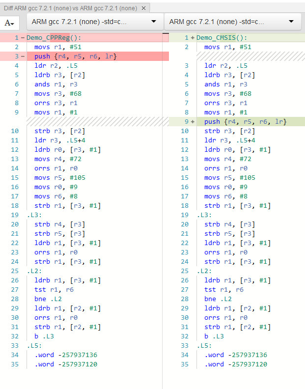

# Performance

Cppreg makes use of C++'s "zero overhead" [capabilities](https://www.youtube.com/watch?v=zBkNBP00wJE) in order to optimize away **all** the code that CppReg utilizes to enforce type safety, specifically the very template heavy code. Understandably most would question the validity of such a claim, so this is written as an attempt to prove that a register interface written with Cppreg is just as fast as the corresponding CMSIS based code written in C.

## Test Setup

For a test example, let's use an imaginary Cortex M0 based microcontroller with the intention of having the UART send out a small string and then toggle two LEDs (PIN1 and PIN3) after every full string transmission. Why imaginary? Because a real implimentation will be longer than most screens, but a real implimentation is provided at the end. An example will be written in C using CMSIS style, then in C++ using CPPReg, and a comparison of the assembly output of both using GCC-ARM with links to GodBolt so the examples can be fiddled with.

### Example peripheral

```
# Imaginary super simple GPIO Peripheral
(GPIO_Base) GPIO Peripheral Base Address: 0xF0A03110
    # 8 bits wide (2 bit per pin)
    # 00 = Input, 01 = Output, 10 = Reserved, 11 = Reserved
    # Our LEDS are on PIN1 and PIN3
    GPIO Direction Register: GPIO_Base + 0x00

    # 8 bits wide (1 bit per pin)
    # 0 = Do not toggle, 1 = Toggle
    GPIO Toggle Register: GPIO_Base + 0x01

# Imaginary super simple UART peripheral
(UART_Base) UART Peripheral Base Address: 0xF0A03120
    # 8 bits wide, write bytes to here to insert into the TX FIFO
    UART TX FIFO Register: UART_Base + 0x00

    # 8 bits wide, Status Register
    # BIT 0 (Enable)  = Set to enable UART, Clear to disable.
    # BIT 1 .. 2      = Reserved0, read only
    # Bit 3 (Sending) = Set to send, stays set till TX FIFO empty.
    # BIT 4 .. 7      = Reserved1, read only
    UART Status Register: UART_Base + 0x01
```

## CMSIS Style

This snippet is based on a CMSIS style code, which makes heavy use of preprocessor macros (the defines) and just maps a struct right onto memory. Notice how we have to do all the binary arithmetic ourselves which is extremely error prone.

```c
#include <stdint.h>

// Structs to map onto memory for each peripheral.
#define __IO volatile
typedef struct {
    __IO uint8_t DIRECTION; // Base + 0x00
    __IO uint8_t TOGGLE;    // Base + 0x01
} GPIO_TypeDef;
typedef struct {
    __IO uint8_t TXFIFO;  // Base + 0x00
    __IO uint8_t STATUS;  // Base + 0x01
} UART_TypeDef;

// Memory address for the where peipherals sit.
#define PERIPH_BASE ((uint32_t)0xF0A03110)
#define GPIOA_BASE (PERIPH_BASE + 0x0000)
#define GPIO ((GPIO_TypeDef *) GPIOA_BASE)
#define UART_Base (PERIPH_BASE + 0x0010)
#define UART ((UART_TypeDef *) UART_Base)

void Demo_CMSIS(){
    // Make only PIN1 and PIN3 to output with masking.
    const uint16_t DIRECTION_PIN_MASK = (0b11u << (1 * 2)) | (0b11u << (3 * 2));
     GPIO->DIRECTION = (GPIO->DIRECTION & ~DIRECTION_PIN_MASK) | (1u << (1 * 2)) | (1u << (3 * 2));

    // Enable the UART.
    const uint8_t UART_STATUS_ENABLE = 0x01u;
    UART->STATUS = UART->STATUS | UART_STATUS_ENABLE;

    // Loop over forever.
    while(true){
        // Put a string into the FIFO.
        UART->TXFIFO = 'H';
        UART->TXFIFO = 'i';

        // Start sending out TX FIFO contents.
        const uint8_t UART_STATUS_SENDING = 1u << 3;
        UART->STATUS = UART->STATUS | UART_STATUS_ENABLE | UART_STATUS_SENDING;

        // Wait till the UART is done.
        while ((UART->STATUS & UART_STATUS_SENDING) != 0u) {}

        // Toggle the GPIO.
        GPIO->TOGGLE = GPIO->TOGGLE | (1u << 0) | (1u << 3);
    }
}
```

## CPPReg style

This is written to mimic the CMSIS example as close as possible. We let CPPReg handle the binary arithmetic for us as well as get all the typesafety and compile time overflow checks by CPPReg. While the CPPReg version is somewhat more verboese for setting up the registers, it is much easier to work with on the consumer end.

```c++
#include "cppreg-all.h"

struct GPIO {
    struct GPIO_Cluster : cppreg::RegisterPack<0xF0A03110, 4u> {};

    struct Direction : cppreg::PackedRegister<GPIO_Cluster, cppreg::RegBitSize::b8, 0> {
        using PIN0   = cppreg::Field<Direction, 2u, 0u, cppreg::read_write>;
        using PIN1   = cppreg::Field<Direction, 2u, 2u, cppreg::read_write>;
        using PIN2   = cppreg::Field<Direction, 2u, 4u, cppreg::read_write>;
        using PIN3   = cppreg::Field<Direction, 2u, 6u, cppreg::read_write>;
    };

    struct Toggle : cppreg::PackedRegister<GPIO_Cluster, cppreg::RegBitSize::b8, 8> {
        using PIN0 = cppreg::Field<Toggle, 1u, 0u, cppreg::write_only>;
        using PIN1 = cppreg::Field<Toggle, 1u, 1u, cppreg::write_only>;
        using PIN2 = cppreg::Field<Toggle, 1u, 2u, cppreg::write_only>;
        using PIN3 = cppreg::Field<Toggle, 1u, 3u, cppreg::write_only>;
        using Reserved = cppreg::Field<Toggle, 3u, 4u, cppreg::read_only>;
    };
};

struct UART {
    struct UART_Cluster : cppreg::RegisterPack<0xF0A03120, 2u> {};

    struct TXFIFO : cppreg::PackedRegister<UART_Cluster, cppreg::RegBitSize::b8, 0> {
        using DATA = cppreg::Field<TXFIFO, 8u, 0, cppreg::write_only>;
    };

    struct STATUS : cppreg::PackedRegister<UART_Cluster, cppreg::RegBitSize::b8, 8> {
        using Enable = cppreg::Field<STATUS, 1u, 0, cppreg::read_write>;
        using Reserved0 = cppreg::Field<STATUS, 2u, 1, cppreg::read_only>;
        using Sending = cppreg::Field<STATUS, 1u, 3, cppreg::read_write>;
        using Reserved1 = cppreg::Field<STATUS, 4u, 4, cppreg::read_only>;
    };
};

void Demo_CPPReg(void){
    // Make the pins be an output.
    GPIO::Direction::merge_write<GPIO::Direction::PIN1>(1)
        .with<GPIO::Direction::PIN3>(1).done();

    // Enable the UART.
    UART::STATUS::Enable::set();

    // Loop over forever.
    while(true){
        // Put a string into the FIFO.
        UART::TXFIFO::DATA::write<'H'>();
        UART::TXFIFO::DATA::write<'i'>();

        // Start sending out TX FIFO contents.
        UART::STATUS::merge_write<UART::STATUS::Enable, 1>()
            .with<UART::STATUS::Sending, 1>().done();

        // Wait till the UART is done.
        while(UART::STATUS::Sending::is_set()) {}

        // Toggle the GPIO.
        GPIO::Toggle::merge_write<GPIO::Toggle::PIN0, 1>()
            .with<GPIO::Toggle::PIN3, 1>().done();
    }
}
```

## Assembly results

[This](https://godbolt.org/#z:OYLghAFBqd5TKALEBjA9gEwKYFFMCWALugE4A0BIEAViAIzkA2AhgHaioCkATAEK8%2B5AM7oArqVTYQAcgD0csGADUqAA5rS2YMqYEARqRakAngDouABgCCcgFR2r15XeUABAGYEm2ZX//qmtoAtCxMTGZITi7uLGJESGT%2BygByBBiswsoAwqxiAG7YemzKEGyoeYXFbsLYbJgmbNhmGAC2AJTRrm4YaiakBMBIRDnofQNDIzyW9JbB0/QAHMoAynUNTaOkambK1uHKE8NZWrWkhZgWNi5yTnc8AMwE5UxiOMpcD9mowkSEbERPrh7k8Xm9fJ9skQTGpsAB9IhGYjCIEg54VcEfL4eMTlIgEdBsMKomy8UEY96QvStZEk6xOBSqDRaYBwgAi2C8TWEkTRHnqnJyAAUhQAlXAAcTh2RF4qlbNwADEAJIpXArOEACRBOC5vhlYsl0tlRoVKrVGu1NiJrWwwjULCkTKCOi4AHYBNd/GJhM8dNZMJhTsIEVi2cpfpgQCAxM8iGpEQjPp7nP46mJWqpMllRdo%2BMQVgQAF4Qj3RZL%2BfSLcgV8sV5T6egANhr/jrFf0Dx4rb87eS%2BibABZa17e262cn2z6/cpFQQipgAOoETAJUOfcOR6OxgGLJMPFPJaccWfzpiYADyHg8tSI64em7%2B27je8BB/bRGwrTUrE/WKhMJ1CwtrKAAKnSyS/KQYioCM0KwnCrQsMIADWHxlqOFYYGwvzYAAHpoEZECw%2BKoKohK/GByj5GEYgQg%2BRFRiAbAZtgAyoHC1K0l84EPLg0ZIXhECdO%2BmHuhOon0uOILrAQHi9qSNiMqBSJEDyUSko8ckCvJBpynCoGitYyqgZaOqcs8%2BomlKhnGaZWpODadoOk6gQsuhh7%2BJ%2B36/vR2S5sA%2BZEIWJarBB/hQTBIygYBKksNxnl%2BN5P4kX5QJEdBsFgbFqkol8AVBSF0ggFW6XuolFbHjo8H0Y%2BTE7kQr6TphyTYbhBGkERJHpOROEjFuMYvqG%2BjEHCvqhRuyiLGIzWpvWbWfh1XWkb1lEDQ1r4NiYn5jcWtUNqN42%2BHIU0zZJyTibNyTJb5/7pZFWUxbCcXcf5eYFnt0aNk2ZUYXNlW%2BieNVhoxz4As2%2B4Va1FGLYRvzdWRC2g4Nu7DYde0g82Z1QwEMP4XDxErUj61DSM%2BjbfCR0gyNd5Uyd01XW20nnV5X4pX%2BkL3YiUXZc9uWQgVH0ll9Xa/TjfhVcowOTSTAJdpDfa431%2BOdfDRMw8jG1o7TGOTV22OK34C0q8tPXE0%2BKONcNFO7RNDE07bx2nYzY4SRVN2pXdfEZTzT3YC9akC%2B9wWfSVQ5i4byiS9LDGy0QQ4Ky1SvtQTCOrf1Fta2T6N2%2BGQ4G0nRt40tatmxrcebeTO1U5NDt087LOu7Nl2aQ8snyR8im2CdyoAmxRJMOpfI6cKhpSqqoG4KKKTWAAMmZre6pZo/6RPU8z/PDnWsBzmOr4bnaB5jk7/ae/KHG/dhFk5Ufmzt2c4XUuAU5YHkJHoHUbR2Bv4/H9cYCYk%2BLtgeiMVASBsCoBQnCdAhRSAeCYOgAA7soEAyML7ACMEwOEC12BvmyPodA6AmA1hoq8NKDF/4R2Zu7O%2BntIQBiDHaEMIwWCBmDDWAaR1QxhEGGwW0AJwp%2BBAefEMPDgBNEwCgtBfcMFhGwTDXBD9/r9kIcQyOEBWGMOENfHgTZShiL4XUEYwRlD0HaO0MMk1LCR3rLYux9i7ERzEtQ2%2BPk6FfAYcGbhbCmEcMznGeWIw2A1kFiHUKLJHaCJ9llW0rQyAmEQiwNQR9H6S1iXCYwRgEkjBlhbTJLATBKIcX4fIRDuo%2BCfrCF%2BfsA55WyBEo6QJow1R/so2xJQTpHXQB4CANVqk5XioHL4DS9pNJADVToj9inTNsaiRuFZS5kXSfk7JvA9ErJdgswm6QMnaLYkQCANj/AEFEXocR2BMCQk0ew3m/t%2BbDO0JEviX0baNOeSAUhdFWnTN4DwWJ8TElqFQfoZCvhrlMJEcoGkwhQhnIkcoDwSQWQnM/J1GqvyjnFJEhVS68yPYcw8T47R3itHCD8fVAJPBQzBOUKEoqhxHlvOBJhPpO8oVfgBUhNQVyiVkuUDSkZJYxnLNIFkpMujI7/NMICnlpKawCsZaM95KyQZ2EOVM/wWgL7bC0HeVAyE8GspAlKhJXLZU3IVayJlmKUEgBFWKogjg%2BLqraQ48F2ibWTNdcobFdxpKkn9fSR47cFL0iUidawqApDaKFEQ9I5gNJBqePyXUK8jTWGyNkdUKwhQXlnsqbIABNLeSal6bD0umzN2bc35qLSWpyp9XLMkPjfFltCCUASqWygAst25UF4EQ1iNb4UCNYP5IVQjWOcC4rw3mwHeEY3S51vmZf9YRAUUVsVzKwlJ3rjYl22YjDWBCiEiIRAMfIBAwiWI1X4CAE60IbkmjVRJqFIS8X4h8r%2BFi1lrNKEu28liGKWDEL6x%2B%2BK/LDuUAAVRBqUlcUTkjPGKL4RZVEtCsJddMpGvb%2B3ir0a0Gk6A4Q4EvVIb5xSoMDSAvoHwcI5KQiUCc89BBL1hBrNBp1n6Y7hhYuEBMpAbUzP8BYtg6B8JSATLu6ZuqJAlEWdgg176gRQEIwSEj2AyMQl0VC5CKEf1AO9gB%2BdYHvW4vFlLdtkHn5stg5NeDlygGP2Q8vNDH8MOYCw8UnDfaB2Ah02p4jpH0jfxtVRi2NG6MMa%2BMxxErGr3EJg1x5pgEQZ8aYAJoTwmfX8vE3hSTOS/oyfnXJ02HF9W/GU86wLGmtOmccS45xbtXHs2s12kCuG/NDpsyBUdVEH1TrPJea8t5QzGZXcA7mWUN24VIIuAYHMiu2P3andWfUGyqLPXFtjTAb3euSPevTQHwwvofVVz9nzsA/olTpiA43jvKBA/V2xEH/xQbswxBziHjlsBQ2V6i6AVzKEQQt7AXmHGdfw1CojtWQsUYcR/S78P7HhaYpF%2BE0XshMeYRehLHHkvjNS5NdLmXb3ZfrKJvLBXpPFJq8Fp0uSEaKcqzxFTWW71080yFj4OmAB%2BD6f1umyKUCAl2vbC/G9dgjemvXTOe/WczkdXuQne3BwHjnV12Jc5sNDDngeg/B/YyH/mCMw/p6FsniOv7I7saj6M6P6MeEhLF3H7GktjJ4/ysQ/HETs/JzlsTEnsBSdbft/wnOtNwa/psi6jX/qK7bW4jtSueu%2BGN919rI6x26cnaeGdI351jYL0QbPl32xRPXdoTdc3QfZAUQCGn81i6rbLutk9u2XfxevU%2Bsnh3UIPdO3p870ZLtS7/Xd4vD2nsx9ZkntrQEQIffDF9pz3rteocPQDoHIPiBg5tcbv9Ee4dhdT8jB3mPscsZ2/jj3ROGIk992T/3InctB5D0thxR%2BGex0PczvBH7Ddpl70zcucGc%2BcBd0JhcoAxdOYvhlBJcedpdUJZcsUZ8m55lrorM3tT8l8t8NdI519/s9cd9PxADbED8AsQCtMbcXtT9qMiRaMMcncYsccu9EtONb9YQ0tvcMtH8w9n8A8qdg9CsLNkgv99oy8MCmZmsmtNlhEPNoFfsTBG8KxlcvgoN09KkF8s9%2Bs9NBt89l0i9l1vs/BCC3MGVMMfM8MTdod1NzdKc38RCbVZNSASgZtUVt1HNshNC%2BsBt4Di8xkPNgC7DQCrs0D0IZD4849IIpsRgFCSDfBUEFDCQmBlDQ9bcsCVdT9NCoM%2Btx09C89zxZ1RtF0AjV8tdftXNN9iCDcKDTcQjqC/d/ckYrcyEHD8thCVC7F3C2J5td9IQfCaw/DxsxkEjgigtQiSFv1wiE9vU1DsgT9M9lAcjT88ic8UJ9Ciji8jDbxS9o9H4TDz5Kiddqj1d9dd8IA6jbCJi6tX8Oj39RD/Aeia9d868%2BpFEvhBj1iaxxspiyFDjkhowxjxD5daxoiXtMj1DsjfNB0tDqls8ztyjbEzDTigdbxLiYSbCQTI5A97inCydni%2BjPw3j4YBFPjMSx0hiCiQMqS30kSHEgSDdsSpD0CLN5iNCKS4S2U1jETNdkTjiN8049cKhsBjAMTrDD8qCQsUD6xcTqd0jilCTa9688Evi/CaTlB%2Bch96T7FGSLjmSLNZiMi59sCliVilieTtS%2BT6wUShSziSBgBgAfBxS/NJSGjpScShCHibVxCQYFMKt/8VNxjYcpAf0ABWXAdY0E2PSImMuQ2I84naFItIj/VQyEztbQ5Yzk3IhEgo6dLYww0o4wnUpDAUogs4sYq48QmggQuxFoz%2BNou4%2BU1M7oqvWbIk7AAYzkvrQfOk7ID9Efa3R7M6T9MYv3askXGAr4SEfw5dKXKMpo2spchxaM6Q8I%2BYxYzM80zMy03PfM4bQs2c3YqiMvA4ksn7P7XXCs2ozEt0m46UpszohUhxJU14lUopbLL43slCYfL9MhGsDU6Ar%2BcXI8kzRAhcp/WsgE/wPU0gg0yOI0tcySFuJNENTuMNbuZYvTXkVubSVNCtKUbtawFYAAaRLTJDLSsjHjhCItIvrRPhcn3mbVdFTPZOyL033GtPThNm7Q4pGCQhQnhAfQgCRn3OXFXCQFDEQRXASHaObIsxcJKGkokqnyxEVHZxA0XLsRAHZ39KU0%2BL4rZ0gorEO0EtfR/IMtQk4ogDEpkskoOWUoSGUBMTMQMwWLgLMUgNMXZ1BMQqSnTI0MMp1JW06l4qsv4pYDMuECQDkk/EwHMpEo1lsokqkrsprOXIcVEqG2KMLyLNvDkqfJbM1RK1cLKz/wGKCtwFMqEu1O8MqogEcqQDcpnMl02VmJQrJDQruHDVWCQFYSQQADUv4cKk08LBQCK4QVhNRrA2QLxFwBq55oNcByLHhKK00pQpqZq5qFrZ4lr6LbRG0mKXQVC2Kljniax28o5agxo%2BrMAkEK8EyVhbqkEpEBoPAr54RpYyxwT/KTSsizq2zUUHrMoRgnr%2BrEEg5gBq8h1oJOzvZUEBpuZPqiciqhFN8oNniUsuDorwa4RJCcUfrLM/qoSAaobZsokMbAa2IsbfAwa7qIb8oqaKApZYaxkcb6a8bgKe9vVMaQBTh51m5A1Or6g5JQ0GQTpu02JgBsAOyRqyQxrdJrIaKp4JRcBFxRQTJlqrRS0LJy0lbu0Va1aNbJ59rd4m1jrnyibWs7pwNT9zqU9Sbq8abvjI59ycqF1QKS8HbMzebgZTz49vYKhkIshJbSBpaOyEQfIVDNBWNUodLUlAYdAQVrrPdKaybUUabwiFNg79kIAlBeb2akFBz/ytK2weA/kpbfAEjIUxMWEaJvAWBGCEUkhC7kExdkVyby7Vyi5lYD004kZk7kauCMko0MxvdUp4qpyJxe9Rcubpy4CEDD8ZdwiQr/sB7QUERUt5FWgRoJFzKQZESLNQ7w7QdI6fxhIj5Ca1AxBaN0h4618yy0Nj6ZbT6iAo6BKwcCqHiGUiBSsb5qEIjwjn6I637z6cNK6QGfI1kDNwwcAfBPwgGIHX6oGdMxg2ISIyANxEr1tgHkGfxoGQY4H504aj6kHd8z6mA/00GjASBBMHxLiyGdpQHKGbsmwYHlAiGEGWTljGHPqo7qGMG6G2QGGw6X7yHmH2HOGSHI5cHxGfIRGT65H8HWHJGihiHwjCC9c7qmgL6kZf0dM5TCrHiko7ambowqypTv9p7%2BCKxebSBEFEIvwQzP7wjkhXziT3zpzjKuSQJeb08/c06nbCdYR0q7Ft7d6LlzLQnbEaS/cR7UAx7fJJ79ibGlzRimTLGwjuG/K0ziaFiycoNFRom/BB7N6uCmgHGkdNzqkQZZGmGoGvHUmnimbimTLwnLJ4qH0vLFQBIZdWnkhYnvGIB4nEmJ7OayFwLecem7UZcvKoAKnxm6IQLpnF6JVvGMrplpmBdS6oLzzew9mjiUNvaX56DG6otmD8mbGIBtUB5hBowwEIEoEYE2J4F7rGnydAnZsab5VsBKmhybLen%2B85lIyVni8ZSNnikxlR9WnwJ1nhNODOzWHI5pKEhdGNZ9G9FDHvSyds69lSADkBpmNhAd4PyIWvJT9pmHQtAAQ4QO7UV%2Bn/dnidn/coXrdmWLpy6vAFwa70ARgPBSB0BMwEhUM2U6W2Ijj2VRG4QEjflu6KxFLkY4lCgIBQJenBLhI5WcmcmNzbbHbZt0rPmM7gnfAztAEuKg7tEeHRGOzo6b69BUB767FJZSnU7TH07qbjXNkY6aJPxHXltm9VZN916U6t62gInOmjtJpD72xr7b6HXI5V6n7eHdN1Xg2h7fBR9HzsWbGFW6mwdR8ZjCbkg82FGxGEHWGoVEEv6AFvVUERnWhx64rFmwdWhEEzB63G3InM3/7YzyDeHsHKI82CHJopHEHrXQcqHYQaHMH6HwHx3%2BjdFVH4HpHH4h3UGp3BGsG12fpF3CG1GuGLNNGzjtHP705EC/0sX8SbHDWPWLH3SrG/c7GHH0lzdhJXHmn3WXiuHLmPm3Wgn/HvGXXAIGW/B2m96Bs/dNK4XZl3lgTMmawO2knm3NWi3Z9rb/rMz1KDnCCh3GbP2EOw2On973RhctmrTgdiBE0gC02ymM3v1z2DGvSr3plcWzgCWLYiWSX3myXyWljKXjAjFaWWn2XbEmXoOBDWWS7xOFdOWhseW%2BWBWhXwEIxRWmaJXbQpWZWu732/BKW41UATBmksCZXuPhMgOQm/dzOLcmndPAWNi/dQXjDpPycVNEOxmkcGy6I5XkhFK/cBolW99xPcO3p8PSgwPImumSPZw7ORIuLyc1Wwc3Om2C3nORNC3e2/BvW47I5WPc786zGQBW7i6vlmXfkNPpbEzfATlcs674pWAm7EVVZnq27gKxXBNtPuHV6S2LE63HQEmG2kPLsIAntL6MusIA2rXFHSCaO/aevlAkuu2v5RdBcBBUOSmN7gYFvkn/j5l2qhbg0RaO5urMLni5atIU1xqla5RlQVhJ5RQVqHg1qJrrvbup5TbDrnR3JLadXvVPEmFQwIl3UyVI46UMZBVrPbdViBlXpweEWGVRsp7Hs8JLB0rLqfRKZmuQZ3rB5OyzXJsQbaU1PLajxE6tCQZcjoehl6lFUhV3l0VuHJZjc1dfxvBfB6eLNJZW6QY6a3mQvoarqMfwa5kLNE2g2NY/viUyYN6geQZAfeUV6Ju0NzYKVUZ%2BpdYHwbUal7lqerUlVP064lURfFexf1tgZ%2BackGJzfm2s7N8rj7HHHWhnGL7ifbEFW1UtU%2B4dVC8AyuzrDXAFoVNSmgfzF0ubf%2B6NY7fiMX3QjnfUb5WSqSh3fsBtUgg9V9LvgI/MT/eYZA/pfeUQ/sm1urb74SbMPDjbSVpgvCnowqXBO2up07PDjyv4QxikZq/jXPOrss3mPilfPvGq%2BKWa%2BBOaX6/ouZm6S4vikEuoBZ6JnYDSPoxVm9EyPkCUOxvMC8nqm2UinNzO/WncjaneGKHSWZl2/a%2BR/hPvGV/7Or/F/i8QPO%2BROXODny/H7D1jm2VTnGDHcT%2BKjUVbn7m4CSBNAlgSvMGaP7bLC0j36lBr%2BWIYEN7Ec75Un%2BPyd5FU0tzIDawdPQCBi0lSV1pWBuatl0Vd4J9FWzzFVtPwL6Gki%2BuXfFhACphKArEYgB/jJx4CY0GUn7DhrrWIAEglKlHZQCWAFYRhRkHXCzDQIOQ2obmV8aMMxgMQXJIQcvOVLclqTyCaecNfXq8j142piuEPSFuXTYEy9qu0KWFLwguTN1OobXLQhimk6%2BU48HVA7oQCO5dxGQzxIUI6BQhndk0I8Z7pKBu53chQGaMitrQoq60qK%2BkF7n4ICHvdGKn3FtKxXTKRwJezCBsHnzlQ5d/EcsKlCMBchQIq4lMUZGa2iQjAXBbgogT3RTiBtw%2B62RIaGGyFwhB61MFIcGAV690W8R6dbHHECRCCSw9GNgHUIpjXwGItQ3IU8gJpjcfukPPVqilcGQJ0qoPcJKoPSodDMhB0O8L8Q/69ZKedSWHlgK4JW9EelgZHqj02zo8bq4NLHh9XLw6lhE0wwSpgGeJSImWpnWxkzRuFD9gB9QwQKUAdj3Z6YoGdKuD3%2BF2hC8aA71CcNboYD7ETiUEaT1KZfcGIjwiAS%2BReFuC3hOQ0FDzj4BfDRoPw06O0FaYAjnCQIu8CCOmRgjmuEIzAfAI56k90kXKe8OGEkGDwBIHKaVGaieGtlP2rwkAEMNBStNihkCaMFwmeB9DPwwPMnLD1S4bNheBBN/mnCgywjtA5jW8jpnt7R8tMF9S9qUPj6/1SqtIpJAiGjAbIwyfAb4QEUlHTIToWvQZFsNUFjIDeQqMMuvyQqHtZRa2SiPKI3osglREpFUVHycavtCBLvesAqz1FqADRIAI0SaOxFmibOS5S0ZsJUG69ae%2BvHOJ2UdGh9uGYgsgvWCtEw9bR7yYYTXH4BYjVhk%2BX4c1Q17eN%2BRKEQUXtB6Eii7QrTX5DcLYHZDTBFg6rs8zgQIJpKQMZTtkKsGxiKwcrLMRIM94ACQAMguFHIPZGKlkRAo7kW4LqG8i/cuYqntsPUHVx8hQ45/hdjZZk5mxbgi5K2JKH1CDBWQIwbIMkSNd2B1eSweXR2Yjjf8OdWgWOP/5SDJxpyEwV4Ufbziaxi494eiM%2BEQBTRy6ZQOWIf5ribRSYtQS8i3FCpzRjiVAfuJsaHjIEx4sxp7WUDnioUJyYwecmvFIo1O6KB8dYLaqE1Tq2hMwNRLAjA0eYNw3uDgDwgzggxV1GcL/R/CfVyedBC2BxJ8DvpqJFgQzEbxaEVC3RGcJiFwiCRwg1GrQAYdYxY68SxAnEp5FCGUl0YV02g9cumU4R1iRgKQQ4pLFkncSliiNdSfCFklGJIQKQIdOZM4qZ1duFEnSRbCkldR8W5KWsd0JGDrA6JWURrpxEITJJWJlEl%2BIqFxDcBsOronqHriSQ/gTAGopjlqOSBhTygwkMwK9gEa0M32XweGPixUzedjk8kOgcRHxb/hlA6wcFtMn8kIIxgkIXKTkmLH0BvcNYHyXTywKxTUikIFKRFKqpr9m453ebtgh/A%2BhhpAw%2BAeGAWCDhLAPAWeErgCqn4Lw3KSKZeVRKSIOp8UxaRiwRSBi4%2BSGIqfVLKkVSkptiHpISxkSYJ5E7xMktkF0leS/ExgCbN9TZAFT6w1UwKXVJKkNTMRTUxLK1M/TrTipTERrogmMBeFNpzqDwJQJtQ5M4yyFewaLXQqwyaEeTW6VxL%2Bn48eYb02qV8HWAtT6gUI40uh1L6hTwpr/FaXaSBwAydpq3SIvLXkhwghprwe0EzLgGTRJp002aeBnmlLFwZk/UwlFLIgxSNAqRCAJtIraQzu%2Bo3fqW3EO6hokZLWEvhmRfiMT8IFyG4b5KyFLiapySVBFjKWnZAUeygFWXhDVkojmIMknwHJKoS0z9uMshwWLR6r7kPBCtdanCHCFTwVQuAWeGyAe5PcruPg17qKE9neyohZ8A%2BCxWRlEzERqhU/HwFBT21H4yVNcHyyGzSs0qrtbKtsRTkLhoE9/dYb4EjTRphAsae1oUjx6YRhE%2B5LUZLHP53gLBk0OObUEeHUj2Jd%2BE7KflrlCdP2DkluSeCZ7PoO5w/OuQVwPwM9SeagfTmkQYiFymEJc%2BNM0PKFr0kqQ2cSsnIo4qVJoXLc8GnIkoLzYYYk1vJRDdpZysJm81OSMU67G9Kh7o1LJFwYgf0bqsVCLrVXp5VVGqzAnjhlVaqXzRJS8tvJtj6ohgue3NaZJ3La6CjmuWk7hpRMf4HNhEDzYAV2LAFSJGRdzNAEAKeagCexv/WghZzJwkjikfeR9IZkjKtVEJn8tsN7B7YaMBZZPIItTMJE6iSgE80uUZxNIeZfeXWLQrSQ2Ke0jKsYsBQVwFYO8nelUiheIuSB9ToF3MnciZLUEyjyZK0L7I/Fb4aw7cIAc/BcyUCALTh9NMdHDxS7epNRrE5ICwvjRsLraJnbwtmWA7fE%2BFzqP3IIu7l81n2/omPniL9z%2B0JFEiqRWyRkU1MB5sIMmVUQpmXIVFBuNvjxLRwMFzmkIHRa3X0U7C6ObRT0o4WOl%2BB3GcNDMhnm/h2KL5fMisLBTBxOKgmRXQrs12bZ/EvOOnZQGYoM4WLboVi7cjkvMoYdJOXyYcvwvJwlKvmLikRQGIf49KjWZS1utb3IXeL/cviuaXkz9pDkD%2B9mdXMEpOIIx85Z%2BGJUwRwX1htFyEXRfdQPFIsycCCzBS82wVfBJCe4qTjY1hY7iZkCLZFgQMlkmL/AdSwzuMmM4TtyS1hHJTwp%2BL39YFVVRxUPK7lBNVRbi9UWIomXiKplXMmZalg87zLPsiy5aSEtIirKv%2BsS2cfWHiXkj9lO7H6IcowUgCTlvPc5doJhYUj9m3GbAeEouIMKycYxAtoXydH8zFF0Us4uiTpU2MXlDS1KDalvCcLYSUA3khACGUetQVjvAMdCofqsrBZZxEUmKU5WgLJ5PKhBocp8DGABVJebhesRUyirSA0YcVaIqlUVEZVeBKWOgEdLOlFVxSblW8rnxhYLVTpLJc0p1XOo9VBq1xRKvcXGr%2BSpqy6kS3nQJS0lTyvwAqxspDYDVopTzDA0mhELWZRmMFj6ptK0L/VIYeVaQCDV4l0lP9UrOGoXCRrMMMa4DKBgzGiDnxeLA5O6sK7q9xp68hIB/I5Y8At5kiRqpClYCiM0UfVZhUPNvGzYuhiLHgE%2BKZwvjK1QK8BdWrti1rW1nwtYc51%2BT3ZPhra6ru2ulqdr2AtSntRYMaQiC0hw6itQ1TsrKAGBxahtWXR4BloZwLAQopImBjdI61SAYcvJ2wnhAkEcgndbIWQq2yuqXcYRBKCFD9oVCv6/9QOlyA%2BhUUUicOdGGrGQgDhioGwJYAeD0BZgNYQcCOSlnIUK5CZNkAQC0CwQeBEG5itGBuEYTP2kIP9XhlA36sYhoAEAHMOKhVgAKBM2xJLH/UpBLAlC8MJBpAD7lIQ2G3DfiEJA1geATA4cjWC43xEPlVIyOCxtVD0AON1G6MDxq%2BB8aIEAmmlMJqE0ibxNUa/Af0WEnSbSerGngPJq41KbsgKmvDYJuUAablAqGsTYRr5o6aTOUmhOjOFY0PATNDmszRZrU2aaawTYLTQ5ok16aXNURWmZhoJ6gRHVFSVBFxuI13CmaZG4DdKCZn0sFNtG4OEVC%2BjVgpoTG%2BsDJrY0gxTNQ2d9NFtyVNSAKgWl0EUsUKdT9Nrmk8Kxrk2TRitC4UrZavK0iaKt6WhIrVsKT1boRbm1UMZpa1eaStPEMrTWG602auNvW5MtKIa06B3NRWsbW1om0daptImh4FVq9EgA5tShBbYNpPC5gzgFwFbdVu43jb%2Byk25QNtpQ07bFRjm1hH1sO3yyA04W6wMImgzWBRQH8S2l9p%2B2gQUtYG8VrFoc3QavgsG%2BDYhumCabrZzcCLb7AAAaKoRUBeAI0Xb4tCI77b9uB1UauNdG7LYxqoVx9JYbIawKBGcCjaLtZm0CCjuVBo6aw00ACvZou37a6toWt7RhRiIE9buFO6DCsAx27asdiWr4DjqB2Ua0tBOzLaHAY25aSdvcnQLgHWXnbdtZmvnaBAF2baWd6W4LVw053MbSeJ2tiBcHY3U61dV2jXVrus1dbWdu25IgdoG1OtSeawEWieHN2Pb1dlOzXSsG123a7dj2vXfIrHkzhjd5wC5M1oYitbzwkIK3b7ts0ibBwAemjQ7o53kSbZH2vXByDiTGgxQ2gUXOrk6CplGQvFQSlLH7HPAsg%2BgMFCUHEDxh4gVwf6ORovDRgfNPA5kZpw%2BXZBm9renDapvb0gAmtKmMxJHDMAosogXwHvSADb2EgiNqoB4MPvaBmAT22UlMO2EZDK6zmbPZTuLsb3JBxd0YOPdGE32MFBRga0zOvpOizxAp8BWBGYM0xsQ99/gRBDFWdJI0i9FmRkEKHiDYSMoM4OMOgHL2%2BBUdF4J/fWAP0gA6dIB1vRTusBFLGMMgTUGABkD5TwiEBqAwzpb3T7YD8Br4MgYIDIHUDGG71IyBWCfSIwskE8HXrAhI7ZwmB3qJ%2BABA8hI4EBo/XajwFWLWD3ugXcfvWVTbUDZOMfZR0hBcH%2BdKwQ/ZQeAD8HnUS%2BlfRfsfiMhFwgyKWN4F2zCsYMgOyFCezAMVgX9rPCAKIZ90SG3dNGgNQcnMRSyu4diZSGVqAPKBm9Oh5IFPqi0daO90tXTd%2B2cNla59bG6Q71JtRCGEgSW/tNGBcNOqfDDwPw2lLkPp6/UbIGQHiKYCyAwyMgcgGwFkCWBUj6AWQAsX4CfDRAEgMAohtSNEAMjCRvETWLDKWAzAg4N0IsDdBugmwCwRDQAE4wy7R5gLIEHCpHWgIAKo2kbKPkBsjMgVI3cxR6lGZAmRvEXAFgAoAMAOAfAMQDICUBqAdAbsKwA4BoBBAggEQOIEkDSAUDWkMEJSByl/A4wvIVfOLVWCxEsgJAXTMkkJB3GTUZg8qY6AfVTsCAagcBJgkb3BC9Qg0gDaUhZ78SbANUVNMIktoMyANWcZQGyGVDih%2By/aAyQeHAknRG52mTEQcMsDWJMIUJ9HTCdAgXgJQEoWeFSOSCMh0TGIpHjMDiP2HktfsDkMwRTBgnBQEJ1MniajikwaDIB5MH4ApNATixWJnE/9A5Mwm49vJ1E8oEpOfCsT9AWk%2BLoMiARGTCOzCpLTiSmBsJvKF4%2BoZf1sRfAsIT498avhCCiAvx1aiEOUBCgp4yoIUJqDhB8BiKkZKAA1ECTtAod1gBDUhssBeo/jy8ZvdYHtOOnSgVpjWracDMrBIyMp5Htie9PmR/jzekXM3sVOwhGTLgCxP6fDO4AfT5p/4wqcpMQAQzNpu0w6YjNUmhTswbM49wtPi6RcCphk4KDsAWI8zoKH0zYCz0cppQ3aFYDdwL0rgP9l%2BrCmXuTKWnZN2E%2BoCOZSAea7jde6%2BiMHH3rE/QOhpGA1AhgjA4TCJ0CEibhCsaaKxFEiiDGG6NgmpIFCAHJtcCDrBcUBSwEebEAnmPN55qGS1Gb3BAgQ653AIiYvApADzz518/CffObnPzkzN8x%2BZSDbnVQu50ipedKDHn5%2B0FmIBebmYwX56UBe89ZsfPc7/AG%2BlXeod33thlzXJhU3HrhC4AZ4fAUkyDFlMFx/o4ul83xDj0gwaLQIei1F0IvcGNQJF6wGRdC0Dnr9YwW/eK0a4P7SAOhvQ2/thr9mFDJ0b/Swj/0ngADdhkA44f8CMW%2BIGBtHSDGQNIGUD3DFS7gDUvo7Jo%2BBwg8QesMnQyDD0igyYfgI/66ddB9S9hEYNqQlLZQkYDCdYtiHJqJFuEykAlCYxbzsFhfTpcB20X1QbFhi8FaYthWWLgOyamxeIukXyL0V3HURYjMpBvLEoFU6ZeUBKHiAKhg4Dhc0PVdtDyLV/b4CgC6XmLOmdyz7s8tpXVQEoCxMevDAjdqFVh2xDYY612GHDkcH86paJMknIzDEXq3pf6uJWhc0F/y8hcexQXTzk19ysLgeA2DrG4kBI50ZkApGBjkxrIzke2PFiCj%2BxnnF2BKNlHzE5AcBKwmprCQ1r3R8gL0f6PpGtrQx2QKMZADjGTrFRkAIOEHBmAHglgN0JYDDKLAeA9AN0IOHoAPA3Q6x2QA8FSMPXMjT1kY%2BQAmNTHyAMxhAPAAgBzHBWagVnhQCoCJVvwuNiMaQFaBuhkNXgJgKijuYgTBju9YwIZxkD0BUjbQfhEQAvBKFBjOAJCBwB8Cc2%2B9eGwoHc0euqyEmvrRm6kYvhJHHrcWXo1tcSPsBOAu1oQHoH0B3NIAeIsYGpqFvBBIwG4bgHkf4BIbnKF4LIMEFaAJAMw%2BgUY3sakAMBEjyR2G4MeGM/bu0ygYAFGmUBugzAPAMwHJrKCEgu%2BEARY7Q0OuMBRghNnwJ1DJCeVcjAgfgMdblt4jzrOAfVVdZrGDgWjZgMMsDfLoQ2WjiwJsIsEsCDgwy11no30ZR5w3triNsY0jZOuo3EAmNtANjdxsrGCbONyO8TdJvk3vAVN6gPoFpvPB6bsgJm%2BQBZtGJ2bqRTm1%2BAVu83HrhAfjaxjtCDGRb8QA46PcluDGZb9djY4rYNvK2DAatq65rZ4Ha3dbD4fW3Hb4BG3ggJt5yubaQCW3rbhR6QIOrWsbWq7CNl227Y9te2fbftsTE0AsRB3CAIdskN2HDsd3xW4DixLHcEAJ2pjSdqNZdftsyAbrd1yu07eesiBXrddxO%2BQBrE8A/7YZFo26DDKDguwtRmYIsEWBJ6pbMNza/DeGMIPVraNpuw4I8Bt2mASAO5owFIA8OQAb9qWx/awcyBsN14PYKKFdvu2yIf9326UEAdd98gWQb%2BzI89ve35H/toByw9OuEPFgNRh4IhvqMl26jtDwcFDbQeO3HrzDnB29fwdS2eAVjph9g%2BRvlHyAsCX0LPsHBAA%3D%3D%3D) is how GodBolt compares the CMSIS and CPPReg versions. Looking at the assembly, it's pretty darn close, with the only diffirence being when to save registers onto the stack (in this case having no performance penalty). In this case (as well as others which have been tested), there is **no** performance penalty which is checked by comparing the assembly.


